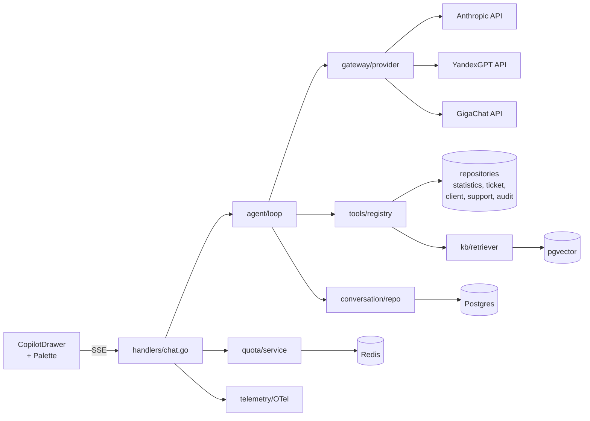

# AI Copilot for Managers — Design Document

**Status:** Approved (single brainstorm pass — all locked-in via session questions).
**Date:** 2026-04-25
**Audience:** Backend / frontend / data / SRE / product
**Track:** AI/ML differentiation, parallel to Ops (health/error tracking) and SCIM Enterprise tracks.
**Sibling specs:**
- `2026-04-25-ops-track-health-and-error-tracking-design.md`
- `2026-04-25-scim-2.0-enterprise-provisioning-design.md`

---

## Context

QuokkaQ today has rich operational telemetry — statistics rollups, SLA monitoring, heatmaps, staffing forecasts, surveys, support reports, audit-style ticket events. None of it is reachable via natural language. Admins and supervisors answer questions like "why did wait time grow last week in unit X" by clicking through 4–5 dashboard pages and exporting CSVs.

There is **no LLM-backed surface** in the product. Existing "AI-flavored" pieces are statistical heuristics (`ETAService` — EWMA + harmonic throughput), an Erlang-C staffing alert (`PredictionService`), and a regex-based comment classifier (`support_report_comment_classify.go`). No agent loop, no embeddings, no provider abstraction.

Competitors (Qmatic, Waitwhile, Qminder, JRNI) have started shipping AI assistants for managers in the last year. Building a credible Copilot is the highest-leverage way to position QuokkaQ as an AI-first platform and create marketing pull beyond commodity queue management.

This document specifies **AI Copilot v1**: a read-only Q&A assistant for admins and supervisors, embedded in the web frontend as a sidebar drawer with command-palette entry, backed by a multi-provider LLM gateway (Anthropic + YandexGPT/GigaChat) and a tool registry that exposes statistics, entity lookups, and wiki search with PII masking and per-tenant RBAC.

**This is the first AI/ML subsystem in QuokkaQ.** Foundational primitives built here (LLM gateway, tool registry, conversation persistence, PII layer, embedding pipeline, eval harness) are designed so future AI features (insight engine, smart routing, voice agent) can reuse them.

---

## Goals

1. Admins and supervisors can answer 80% of "why / what / how / where" operational questions without leaving the page they're on.
2. The product has a credible AI surface to demo and to anchor marketing claims ("QuokkaQ AI").
3. Underlying LLM choice is configurable per tenant and per plan; no provider lock-in.
4. PII never leaves the tenant boundary unmasked, regardless of provider.
5. Costs are predictable per-tenant; admins see consumption.
6. Foundation is reusable — the same gateway, tools, and conversation surfaces serve later AI features without rewrite.

## Non-goals (v1)

- Write actions / suggested actions / autonomous agent (deferred — separate v2 spec).
- Proactive insights / push notifications (deferred).
- Free-text NLP over survey responses or support comments (deferred — separate Insight Engine spec).
- Visitor-facing public chatbot (separate spec, different threat model).
- Operator/staff Copilot (separate spec, different latency budget and contextual sources).
- Self-hosted LLM for on-prem (depends on `onprem-distribution-licensing.md`).
- Custom tenant tools / marketplace (deferred).

---

## Decisions (locked-in via brainstorming)

| # | Decision | Rationale |
|---|---|---|
| 1 | **v1 scope: read-only Q&A only.** | Lowest blast radius for first AI surface; no audit/undo/governance burden; ships fastest. |
| 2 | **Audience: admins and supervisors only.** | Clear ICP, RBAC simple, real "boring problems" to solve, easy demo path. Operators / visitors are separate specs. |
| 3 | **Multi-provider, cloud-only LLM gateway.** Two adapters at launch: **Anthropic Claude** and **YandexGPT or GigaChat** (one of the two; finalized in Phase 2). | RU enterprise/gov sales blocked by Western-only providers. Self-hosted deferred to v2 (depends on on-prem track). |
| 4 | **Data sources: aggregated metrics + wiki + entity lookups (tickets / clients / support reports).** Free-text from surveys/comments excluded. | Highest-value question coverage with manageable PII surface; explicit boundary against Insight Engine. |
| 5 | **UX: sidebar drawer (right) + command palette (`⌘+K`) integration.** Auto-attach page context. | Linear/Notion/Vercel pattern; matches existing palette infra. Floating bubble rejected (overlaps content); standalone page rejected (workflow-detached). |
| 6 | **Server-orchestrated tool-use** (Approach A from brainstorm). | Keeps API keys, system prompts, RBAC, and audit on the backend; frontend stays thin; provider-agnostic. |
| 7 | **PII masking enforced at tool-output boundary**, before any data leaves the process toward the LLM. Three levels (`strict / standard / relaxed`), per-tenant. | Defense-in-depth; assumes LLM provider is untrusted. |
| 8 | **pgvector on existing Postgres 16** for the wiki KB. | One fewer system to operate; pgvector is production-ready and matches our scale. |
| 9 | **`copilot_v1` plan-feature gate** in `subscriptionfeatures`. | Gates the whole feature on/off per plan and per tenant; aligns with existing billing. |
| 10 | **Eval harness in CI** with golden-set of ≥30 reference questions. | Without it, prompt and tool changes silently regress quality. |

---

## Section 1 — System architecture

### 1.1 Module layout

```
apps/backend/internal/copilot/
├── gateway/             # LLM provider abstraction
│   ├── provider.go      # LLMProvider interface
│   ├── anthropic.go     # Claude adapter (anthropic-sdk-go)
│   ├── yandex.go        # YandexGPT adapter (HTTP)
│   ├── gigachat.go      # GigaChat adapter (HTTP, OAuth bearer)
│   ├── registry.go      # per-tenant provider selection
│   ├── pricing.go        # per-provider per-model rate table
│   └── prompts/          # system prompts, persona, examples
├── agent/               # orchestrator
│   ├── loop.go          # multi-turn execution
│   ├── streaming.go     # SSE event emission
│   └── policy.go        # max-iter / timeout / abort
├── tools/               # tool registry
│   ├── registry.go      # registration + dispatch
│   ├── tool_*.go        # individual tools (one file each)
│   ├── pii.go           # PII masking utilities
│   └── rbac.go          # RBAC guard helpers
├── conversation/        # threads + messages persistence
│   ├── models.go        # gorm models
│   ├── repository.go
│   └── service.go
├── kb/                  # wiki RAG
│   ├── indexer.go       # MDX → chunks → embeddings
│   ├── retriever.go     # query → top-k chunks
│   └── embedder.go      # uses gateway when capability available
├── quota/               # per-tenant budgets
│   ├── service.go
│   └── plan_features.go # gate logic
├── telemetry/           # OTel spans + metrics
├── eval/                # golden-set harness (CI-runnable)
└── handlers/            # HTTP entry points
    ├── chat.go          # POST /api/copilot/threads/:id/messages (SSE)
    ├── threads.go       # CRUD on threads
    ├── feedback.go      # thumbs up/down
    └── reindex.go       # admin: rebuild KB
```

Frontend additions:

```
apps/frontend/components/copilot/
├── CopilotProvider.tsx     # context: open/closed, current thread, page context capture
├── CopilotDrawer.tsx       # sidebar drawer
├── CopilotPaletteEntry.tsx # extends existing command palette
├── MessageList.tsx
├── MessageBubble.tsx       # markdown + code + tables + citations + tool-call cards
├── Composer.tsx            # input with attach-page-context toggle
├── EmptyState.tsx          # 6 example queries (i18n)
└── hooks/
    ├── useCopilotStream.ts # SSE consumer
    └── usePageContext.ts   # snapshots pathname + entity ids
```

### 1.2 Data stores

- Postgres (existing) — new tables `copilot_threads`, `copilot_messages`, `copilot_tool_calls`, `copilot_feedback`, `copilot_kb_chunks` (pgvector).
- Redis (existing) — rate-limit counters, in-flight stream session state, abort flags keyed by `request_id`.
- No new external systems in v1.

### 1.3 Component diagram



---

## Section 2 — LLM gateway

### 2.1 Provider interface

```go
package gateway

type LLMProvider interface {
    Name() string
    CreateMessage(ctx context.Context, req CreateMessageRequest) (*Message, error)
    StreamMessage(ctx context.Context, req CreateMessageRequest, sink StreamSink) error
    Embed(ctx context.Context, texts []string) ([][]float32, error) // optional
    SupportedFeatures() ProviderFeatures
}

type CreateMessageRequest struct {
    Model         string
    System        string
    Messages      []ChatMessage
    Tools         []ToolDefinition
    ToolChoice    ToolChoice
    MaxTokens     int
    Temperature   *float32
    Stop          []string
    Metadata      map[string]string // tenant_id, user_id, thread_id (for tracing)
}

type ProviderFeatures struct {
    SupportsTools     bool
    SupportsStreaming bool
    SupportsEmbedding bool
    MaxContextTokens  int
}

type StreamSink interface {
    OnTextDelta(delta string)
    OnToolCall(call ToolCall)
    OnComplete(usage Usage)
    OnError(err error)
}
```

### 2.2 Adapter notes

| Adapter | Tooling | Streaming | Embedding | Notes |
|---|---|---|---|---|
| **Anthropic** | native `tool_use` blocks | native SSE | not directly (use Voyage / OpenAI for embeddings, or fallback) | reference adapter; production-grade SDK exists. |
| **YandexGPT** | function calling in newer models, JSON-Schema bridge for older | streaming via gRPC; we wrap as line-buffered HTTP | native via separate Yandex Embeddings API | auth via IAM token (refreshed from service-account key); adapter aligns tool format and context-length. |
| **GigaChat** | native function calling (Sber API) | streaming supported | native | OAuth2 client-credentials with bearer refresh; per-platform-operator credentials. |

Embedding capability: if selected provider lacks embeddings, the gateway falls back to a configured `embedding_provider` (independent setting), default `voyage-3` (Anthropic-recommended) or `text-embedding-3-small` via OpenAI. Tenants on RU-only mode use Yandex Embeddings.

### 2.3 Tenant configuration

New columns on `tenants` (migration):

| Column | Type | Default | Notes |
|---|---|---|---|
| `copilot_enabled` | bool | derived from plan-feature | gating override (admin can disable even if plan allows). |
| `copilot_provider` | text enum | `'anthropic'` | one of `anthropic`, `yandex`, `gigachat`. |
| `copilot_model` | text | provider default | tenant override. |
| `copilot_pii_level` | text enum | `'standard'` | `strict / standard / relaxed`. |
| `copilot_embedding_provider` | text | `'voyage'` | `voyage / openai / yandex / gigachat`. |
| `copilot_locale_pref` | text | `null` | optional pinned locale; default follows user. |

Self-service switching of provider/model lands in v1.5; in v1 it's a platform-operator-only setting.

### 2.4 Secret management

Provider API keys live in the existing secrets layer (env-supplied + decrypted via `SSO_SECRETS_ENCRYPTION_KEY`-style mechanism). One credential set per provider per platform-operator. Yandex IAM tokens and GigaChat OAuth bearer tokens are refreshed in-process by their adapters; refresh failures surface as structured `provider_unavailable` errors.

---

## Section 3 — Tool registry

### 3.1 Tool definition

```go
package tools

type Tool struct {
    Name           string                              // "get_unit_summary"
    Description    string                              // shown to LLM
    Schema         json.RawMessage                     // JSON Schema for args
    RequiredScopes []string                            // RBAC, e.g. ["unit:read", "stats:read"]
    Handler        func(ToolCtx, json.RawMessage) (Result, error)
    RateLimit      Limit                               // per-user/per-minute
}

type ToolCtx struct {
    TenantID  string
    UserID    string
    Roles     []string
    ThreadID  string
    RequestID string
    Locale    string // ru | en
    PIILevel  string // strict | standard | relaxed
}

type Result struct {
    Content    json.RawMessage // structured for LLM consumption
    Citations  []Citation      // optional source pointers (URL, doc id, etc.)
    Truncated  bool
    DurationMs int
}
```

### 3.2 v1 toolset (12 tools)

**Aggregated metrics (read-only, no PII):**

| Tool | Inputs | Output |
|---|---|---|
| `list_units` | `filter?: { search, region }` | array of `{id, name, region, active}` |
| `get_unit_summary` | `unit_id, period {from, to, granularity}` | `{avg_wait, p95_wait, throughput, sla_hit_rate, served, abandoned}` |
| `get_service_breakdown` | `unit_id, period, group_by` | per-service stats |
| `get_staff_performance` | `unit_id, period` | array of `{counter_id, served, avg_serve_time, no_show_rate}` |
| `get_hourly_load` | `unit_id, date` | hourly heatmap series |
| `get_survey_aggregates` | `unit_id, period` | NPS-like aggregates (no free-text) |
| `get_sla_breaches` | `unit_id, period, limit` | array of breach events with timestamps + service |

**Entity lookups (PII-masked + RBAC-checked):**

| Tool | Inputs | Output |
|---|---|---|
| `lookup_ticket` | `ticket_id_or_number, unit_id?` | masked ticket: `{id, number, service, status, wait_time, serve_time, counter, masked_visitor}` |
| `search_clients` | `filter {tag, last_visit_after, limit≤50}` | masked client summaries: `{id, masked_name, tags, visit_count, last_visit}` |
| `lookup_support_report` | `id` | report header + comment count + classification (no full free-text in v1) |

**Knowledge & operations:**

| Tool | Inputs | Output |
|---|---|---|
| `search_wiki` | `query, k≤5, locale?` | array of `{path, title, section, snippet, score}` |
| `search_audit_events` | `filter {actor_id?, action?, since, until, limit≤50}` | event list (action codes only, no PII payloads) |

Each handler runs:

1. JSON-Schema validation of `args`.
2. RBAC guard: caller must hold one of `RequiredScopes` for `TenantID`. Reject otherwise with structured error the LLM can read.
3. Tenant boundary: every repo call is scoped to `TenantID`; no cross-tenant aggregates.
4. Underlying repo/service call.
5. PII mask: `pii.Mask(out, ctx.PIILevel)` (Section 5).
6. Truncation: result content is hard-capped at 16 KB per call; over-cap marks `Truncated=true` and returns a representative slice.

### 3.3 Tool registration

Tools self-register at module init via `registry.Register(tool)`. The agent loop snapshots the registry at request-build time and filters by caller scope. The list shipped to the LLM contains only tools the caller can actually call — protects against the LLM "trying" forbidden tools (cleaner errors, fewer wasted tokens).

---

## Section 4 — Agent loop

### 4.1 Algorithm

```
ON message_arrival(thread_id, content, page_context):
    quota_check(tenant) → reject if exceeded
    history    ← load thread messages (last N, capped by token budget)
    page_ctx   ← serialize page_context (pathname, entity ids, locale)
    tools_set  ← registry.filter(caller.scopes)
    sys_prompt ← build_system_prompt(persona, page_ctx, locale, tenant)

    for iter in 1..MAX_ITER (default 6):
        req ← {
            system: sys_prompt,
            messages: history + new_user_msg + tool_results_so_far,
            tools: tools_set,
            tool_choice: auto,
            max_tokens: 2048,
            metadata: {tenant_id, user_id, thread_id, request_id},
        }

        provider.StreamMessage(req, sink):
            on text_delta: emit SSE text_delta
            on tool_call: collect (do not emit final until tool returns)
            on complete: capture usage

        if response is final text only:
            persist messages + tool_calls
            emit message_complete{tokens, cost_estimate}
            return

        for each tool_call in response:
            emit SSE tool_call_started{name, args_summary}
            result ← registry.dispatch(tool_call, ctx)
            emit SSE tool_call_completed{name, result_summary, duration_ms}
            append tool_result to messages

    # iter cap reached
    emit error{code: max_iterations}
    persist partial state
```

### 4.2 Limits and aborts

- `MAX_ITER` = 6 tool calls per turn (configurable per plan).
- Wallclock timeout: 60s per turn.
- Per-tool timeout: 8s (overridable per tool).
- Abort: client `POST /api/copilot/abort/:request_id` flips a Redis flag; loop checks flag between iterations and on each provider-stream event.
- Cancellation propagates downstream (`context.Context` cancellation).

### 4.3 Cost accounting

Each iteration captures `Usage{input_tokens, output_tokens}` from the provider response. The loop sums and persists totals on the assistant message. Cost estimate uses a per-provider rate table (`gateway/pricing.go`); displayed to users in `message_complete` event and surfaced on the cost dashboard.

---

## Section 5 — PII masking

### 5.1 Levels

| Level | Phone | Email | Full name | Address | National IDs |
|---|---|---|---|---|---|
| **strict** | `+7 XXX XXX-XX-12` (last 2 digits visible) | `j***@domain.tld` | initials only (`I.I.`) | redacted | redacted |
| **standard** | `+7 XXX XXX-XX-12` | `j***@domain.tld` | as-is | as-is (no street number) | redacted |
| **relaxed** | as-is | as-is | as-is | as-is | redacted |

Default per tenant: `standard`. Tenants on regulated verticals (banking, healthcare, gov) start at `strict` via plan-default.

### 5.2 Implementation

`pii.Mask(out any, level string) any` — recursive walker that uses struct tags:

```go
type ClientSummary struct {
    ID          string `json:"id"`
    Name        string `json:"name"        pii:"full_name"`
    Phone       string `json:"phone"       pii:"phone"`
    Email       string `json:"email"       pii:"email"`
    Tags        []string `json:"tags"`
    VisitCount  int    `json:"visit_count"`
}
```

Tag values match a registered set (`full_name`, `phone`, `email`, `address`, `national_id`, `freetext`, `passport_partial`). Untagged fields are passed through unchanged. Walker handles slices, maps, pointers, anonymous structs.

### 5.3 Audit and assertions

- Every tool result is logged in `copilot_tool_calls.result_summary` **post-masking**.
- Property-test fixture asserts no untagged PII patterns leak into the LLM-bound payload (regex on phone, email, common name patterns) — runs in CI.
- Free-text fields (e.g., support report bodies, survey free-text) are explicitly excluded from v1 tool outputs (a guardrail beyond masking — the data simply doesn't reach the LLM).

---

## Section 6 — Conversation persistence

### 6.1 Schema

```sql
CREATE TABLE copilot_threads (
    id            uuid PRIMARY KEY,
    tenant_id     uuid NOT NULL,
    user_id       uuid NOT NULL,
    title         text,                       -- auto-summarized from first message
    locale        text NOT NULL,
    created_at    timestamptz NOT NULL DEFAULT now(),
    updated_at    timestamptz NOT NULL DEFAULT now(),
    deleted_at    timestamptz                  -- soft delete
);
CREATE INDEX ON copilot_threads (tenant_id, user_id, updated_at DESC);

CREATE TABLE copilot_messages (
    id            uuid PRIMARY KEY,
    thread_id     uuid NOT NULL REFERENCES copilot_threads(id) ON DELETE CASCADE,
    role          text NOT NULL,               -- user|assistant|tool|system
    content       jsonb NOT NULL,              -- markdown text, tool_use blocks, tool_result, etc.
    tokens_in     int,
    tokens_out    int,
    provider      text,                        -- anthropic|yandex|gigachat
    model         text,
    cost_usd_x10000 int,                       -- micros
    created_at    timestamptz NOT NULL DEFAULT now()
);
CREATE INDEX ON copilot_messages (thread_id, created_at);

CREATE TABLE copilot_tool_calls (
    id              uuid PRIMARY KEY,
    message_id      uuid NOT NULL REFERENCES copilot_messages(id) ON DELETE CASCADE,
    tool_name       text NOT NULL,
    args_redacted   jsonb,                     -- args after redaction
    result_summary  jsonb,                     -- masked result summary
    duration_ms     int,
    status          text NOT NULL,             -- ok|rbac_denied|invalid_args|error|timeout
    error_message   text,
    created_at      timestamptz NOT NULL DEFAULT now()
);
CREATE INDEX ON copilot_tool_calls (message_id);

CREATE TABLE copilot_feedback (
    id            uuid PRIMARY KEY,
    message_id    uuid NOT NULL REFERENCES copilot_messages(id) ON DELETE CASCADE,
    user_id       uuid NOT NULL,
    rating        smallint NOT NULL,           -- -1, 0, +1
    comment       text,
    created_at    timestamptz NOT NULL DEFAULT now()
);
```

### 6.2 Retention

Default 90 days. Per-tenant configurable up to 365. Background Asynq job purges threads older than retention nightly; cascades clean up messages, tool calls, feedback. Soft-deleted threads purged after 30 days.

### 6.3 Tenant isolation

All reads filter by `tenant_id`. Cross-tenant access is impossible at the repository layer; users in multiple tenants see separate thread lists per tenant context.

---

## Section 7 — Knowledge base (wiki RAG)

### 7.1 Source

Wiki MDX files under `apps/frontend/content/wiki/**`. Locale split by directory or front-matter (existing convention). Per-tenant overrides land in v2; v1 indexes the global wiki only.

### 7.2 Indexing pipeline

```
On wiki change (CI hook OR manual /api/copilot/kb/reindex):
  1. Walk MDX files, parse frontmatter (locale, section, tags).
  2. Strip MDX components → plain text + section headers preserved as anchors.
  3. Chunk: ~500 tokens per chunk, 50-token overlap, prefer breaking at headings.
  4. For each chunk: gateway.Embed(text)
  5. Upsert into copilot_kb_chunks (path, anchor, locale, text, embedding, hash).
  6. Delete chunks with hashes no longer present (deleted/edited content).
```

### 7.3 Schema

```sql
CREATE EXTENSION IF NOT EXISTS vector;

CREATE TABLE copilot_kb_chunks (
    id          uuid PRIMARY KEY,
    path        text NOT NULL,            -- "ru/admin/sso/oidc-setup"
    anchor      text,                     -- heading-id
    locale      text NOT NULL,
    section     text,                     -- top-level section
    text        text NOT NULL,
    text_hash   text NOT NULL,
    embedding   vector(1536) NOT NULL,    -- dim depends on embedder; configurable
    tokens      int NOT NULL,
    indexed_at  timestamptz NOT NULL DEFAULT now()
);
CREATE INDEX ON copilot_kb_chunks USING ivfflat (embedding vector_cosine_ops) WITH (lists = 100);
CREATE INDEX ON copilot_kb_chunks (path, locale);
```

Embedding dimension is provider-dependent; `embedding` column type is parametric in migration scripts. We allocate 1536 by default (OpenAI / Voyage compatible); Yandex Embeddings (256 dim) require a separate column or table — handled in Phase 2 when second provider lands.

### 7.4 Retrieval

`kb.Retrieve(query, locale, k)`:

1. Embed query via tenant's `copilot_embedding_provider`.
2. Cosine similarity search in `copilot_kb_chunks` filtered by locale.
3. Top-k=5 by default; configurable via tool args.
4. Return chunks with `path`, `anchor`, `snippet` (first 200 chars), `score`.

`search_wiki` tool wraps this and returns citations — frontend renders them as inline pills linking to `/help/<path>#<anchor>`.

---

## Section 8 — API contract

### 8.1 Endpoints

```
POST   /api/copilot/threads                          → 201 {id}
GET    /api/copilot/threads?limit&cursor             → 200 {threads, next_cursor}
GET    /api/copilot/threads/:id                      → 200 {thread, messages}
PATCH  /api/copilot/threads/:id                      → rename
DELETE /api/copilot/threads/:id                      → soft delete
POST   /api/copilot/threads/:id/messages             → 200 SSE stream
                                                       body: {content, page_context}
POST   /api/copilot/messages/:id/feedback            → 200 {ok}
                                                       body: {rating, comment?}
POST   /api/copilot/abort/:request_id                → 204
POST   /api/copilot/kb/reindex                       → 202 {job_id}    (admin only)
GET    /api/copilot/quota                            → 200 {used, limit, period}
```

All under existing JWT auth + tenant resolution middleware. Admin-only endpoints gated by `copilot:admin` role.

### 8.2 SSE event types

| Event | Payload |
|---|---|
| `message_start` | `{message_id}` |
| `text_delta` | `{delta}` |
| `tool_call_started` | `{call_id, name, args_summary}` |
| `tool_call_completed` | `{call_id, name, status, duration_ms, result_summary}` |
| `citation` | `{tool_name, ref}` (may emit multiple per turn) |
| `message_complete` | `{message_id, tokens_in, tokens_out, cost_usd_x10000}` |
| `error` | `{code, message, retryable}` |

Heartbeat: SSE `: keepalive` comment every 15s to keep proxies open.

### 8.3 OpenAPI

All endpoints documented via `swag` (existing `pnpm nx openapi backend` flow). Frontend `pnpm nx orval frontend` regenerates the typed client. CI's `openapi:check` and `orval:check` enforce contract sync.

---

## Section 9 — Frontend UX

### 9.1 Drawer

- Right-aligned, full-height drawer; widths `420 / 480 (default) / 560 px`, user-resizable, persisted in localStorage.
- Open/close state in `<CopilotProvider>`; mounted in `app-layout.tsx` so it's available on every authenticated page.
- Hotkey `⌘+Shift+L` to toggle (configurable). Close on `Esc`.

### 9.2 Composer + page context

- Textarea + send button + "Attach page context" toggle (default on).
- Attached context is shown as a dismissible chip ("Page: Unit Almaty / Statistics / 2026-04-18 → 2026-04-25").
- Slash-commands as scaffolding for v2 (e.g., `/explain-chart` once we have proactive insights).

### 9.3 Message rendering

- Markdown via `react-markdown` (already used for wiki) with our existing renderers (code with copy, tables with horizontal scroll).
- Streaming cursor while tokens arrive.
- **Tool-call cards** — collapsible, show: name (humanized), duration, redacted result summary as JSON tree. RBAC denials shown with a clear inline note.
- **Citation pills** — inline footnote-style badges that link to `/help/<path>#<anchor>` for wiki citations or to a deep-link in the app for entity citations.
- **Cost footer** — small text "Used N tokens (~$X)" on each completed assistant message; enabled per-tenant.

### 9.4 Command palette

The frontend already has a command palette. We add a top-level entry "Ask Copilot…" that, when typed, switches the palette into a Copilot input mode. Pressing Enter creates a new thread with the page context and opens the drawer with the streaming response.

### 9.5 Empty state and discovery

- Empty thread shows 6 example queries (translated ru/en):
  - "Why did the average wait grow yesterday in unit X?"
  - "Top 3 services by abandonment rate this month"
  - "How do I configure SSO with Azure AD?" (wiki-routed)
  - "Show NPS by service for the last 30 days"
  - "Which counter served the most clients last week?"
  - "Find recent SLA breaches in the Almaty unit"
- "What can Copilot do?" link opens an in-app help page that documents capabilities, limits, and a sample of tools.

### 9.6 i18n

- All UI strings via `next-intl`; messages in `apps/frontend/messages/{en,ru}/copilot.json`.
- LLM responses follow the user's locale (system prompt instructs the model accordingly + locale is passed in metadata).

### 9.7 Accessibility

- Drawer is a focus trap with restore-focus on close.
- All interactive elements have accessible labels.
- Screen reader announces new assistant messages (aria-live polite); tool-call status changes announced as updates.
- Keyboard navigation through messages.

---

## Section 10 — Quotas and billing

### 10.1 Plan-feature gate

- New row in `subscription_features`: `copilot_v1`. Plans that include it expose Copilot.
- Per-plan quotas (configurable in `subscriptionplan` package):

| Plan tier (illustrative) | Messages/day per tenant | Tokens/month per tenant |
|---|---|---|
| Standard | 200 | 1.5M |
| Pro | 1000 | 10M |
| Enterprise | unlimited | negotiated |

### 10.2 Enforcement

- Soft limit at 80%: warning toast + non-blocking banner in drawer.
- Hard limit: block message creation with structured error containing upgrade CTA. Existing in-flight stream is allowed to finish.
- Counters held in Redis with daily/monthly windows; periodic reconciliation against `copilot_messages` aggregate.
- Per-user-per-minute rate-limit (default 30 messages/min) to prevent runaway clients.

### 10.3 Cost dashboard

- Tenant-admin page under settings: tokens spent, cost estimate, top users, top tools, thumbs-up rate, abort rate.
- Last 30 days, daily series; CSV export.

---

## Section 11 — Observability and evals

### 11.1 OTel spans

```
copilot.handle_message  (handler)
├── copilot.quota_check
├── copilot.agent.iter (one span per loop iter)
│   ├── copilot.llm.create_message  (provider name in attribute)
│   └── copilot.tool_call.<name>    (tenant, scopes, status)
└── copilot.persist
```

Each span carries: `tenant_id`, `user_id`, `thread_id`, `request_id`, `provider`, `model` (no PII).

### 11.2 Metrics

- `copilot_tokens_total{provider, direction}`
- `copilot_request_duration_seconds{outcome}`
- `copilot_tool_call_duration_seconds{tool, status}`
- `copilot_abort_total`
- `copilot_feedback_total{rating}`
- `copilot_kb_retrieval_score{quantile}`

Exported via existing OTLP pipeline.

### 11.3 Eval harness

- Package `internal/copilot/eval/` with a CLI command and CI integration.
- Golden set: ≥30 reference questions in `eval/golden/*.yaml`, each with:
  - Input question (locale variant)
  - Expected tool calls (set, in any order; some optional)
  - Reference answer (rubric: must mention X, must not assert Y)
- Runner: replays each question against a stub-mode gateway that calls real tools but a deterministic LLM mock (fixture-driven) AND optionally a live provider on a `--live` flag.
- Assertions: tool selection matches; no PII leaked; response language matches locale; rubric pass.
- CI: runs in stub mode on every PR touching `internal/copilot/**` or `apps/frontend/content/wiki/**`. Live runs nightly.

---

## Section 12 — Testing

| Layer | What |
|---|---|
| Unit | every tool with synthetic data; PII-mask walker (table-driven + property fuzz); pricing rate table. |
| Adapter contract | each provider adapter implements `LLMProvider` and passes a shared compliance suite (mock HTTP). |
| Agent loop | integration tests with stub-provider that scripts tool-call sequences (text-only, single-tool, multi-tool, error, abort, max-iter). |
| Quota | concurrent-write tests against Redis; soft/hard threshold edge cases. |
| Conversation | persistence + retention purge correctness. |
| KB | indexer determinism (same input → same chunks); retrieval ordering on a fixed corpus. |
| E2E | testplane: open palette → ask → assert SSE messages → assert citation links. |
| Eval | CI golden-set in stub mode; nightly live mode. |

---

## Section 13 — Rollout

Three implementation plans, sequenced. Each plan is a separate spec file (`...-plan-1-foundation.md` etc.) authored by `writing-plans` after this design is approved.

### Phase 1 — Foundation

- Postgres migrations (threads, messages, tool calls, feedback).
- LLM gateway interface + Anthropic adapter.
- Tool registry skeleton + 4 metrics tools (`list_units`, `get_unit_summary`, `get_service_breakdown`, `get_hourly_load`).
- Agent loop with streaming; SSE handler; quota service (basic plan-feature gate, no per-plan limits yet).
- Conversation persistence + retention.
- Sidebar drawer + composer + message renderer (no palette integration yet).
- OpenAPI + Orval regen.
- Unit + adapter-contract + integration tests.

**Deliverable:** Internal demo — admin opens drawer, asks "How was unit X yesterday?", gets a streamed answer that called 1–2 tools.

### Phase 2 — RAG, second provider, palette, citations

- pgvector migration + indexing pipeline (CI + manual reindex endpoint).
- `search_wiki` tool with citations.
- Second adapter (Yandex or GigaChat — choice finalized at start of Phase 2 based on data-residency need from first design partners).
- Tenant-config columns + admin toggle.
- Command palette extension.
- Citation pills + improved tool-call card UI.
- Eval harness in CI.

**Deliverable:** External-ready demo with provider-switching, citations to wiki, eval-gated changes.

### Phase 3 — Entity tools, quotas, polish

- Entity tools: `lookup_ticket`, `search_clients`, `lookup_support_report`, `search_audit_events`, `get_staff_performance`, `get_survey_aggregates`, `get_sla_breaches`.
- PII masker tag-driven implementation + property tests.
- Per-plan quotas + cost dashboard.
- Full observability dashboards (Grafana boards).
- Empty-state examples + in-app help.
- Accessibility audit.

**Deliverable:** GA — `copilot_v1` plan-feature billable; pilot tenants migrated.

---

## Section 14 — Risks and mitigations

| Risk | Mitigation |
|---|---|
| LLM hallucinates metrics not actually returned by tools | System prompt mandates "answer only from tool outputs; if unsure, say so"; eval rubric checks; tool outputs include `as_of` timestamps. |
| Tenant sees another tenant's data via prompt manipulation | Tenant scoping enforced at repository layer (not in prompts); RBAC guard on every tool; audit logs of tool args/results. |
| Provider outage degrades the whole feature | Per-tenant fallback chain in gateway (tenant primary → secondary if configured); structured error surfaces "service unavailable" without crashing UI. |
| Provider cost runaway from a single tenant | Hard quotas + per-user rate limits + abort endpoint + circuit-break on sustained 5xx. |
| Embedding dim mismatch between providers | Re-index required when embedding provider changes; admin endpoint flagged with cost warning; future plan: per-provider chunk tables. |
| Wiki content drift causes stale answers | Reindex hooked to wiki PRs; `as_of` shown in citations; drift telemetry compares retrieval scores. |
| LLM SDK vulnerabilities | Adapters are thin and pinned; outbound traffic restricted to provider domains via egress allow-list. |

---

## Section 15 — Open questions deferred to Phase 2

1. **Choice between YandexGPT and GigaChat as the RU provider.** Decided based on first three design-partner tenants' data-residency / supplier-lock-in preferences.
2. **Dedicated embedding column vs separate table per provider.** Resolved when second provider is wired up.
3. **Whether to expose Copilot to platform-operator console (cross-tenant questions).** Deferred — separate spec.

These do not block Phase 1.

---

## Appendix A — System prompt sketch

```
You are QuokkaQ Copilot, an assistant for queue-management administrators
and supervisors. You answer questions using the tools provided. Answer in {{locale}}.

Rules:
- Use tools to fetch data; never invent numbers or entities.
- If a tool returns no results, say so — do not guess.
- When citing wiki content, include the citation reference returned by the tool.
- Be concise. Use markdown tables for tabular data, bullet lists for short
  comparisons, and short paragraphs for explanations.
- If the user's question is ambiguous (e.g., no time period), ask one clarifying
  question instead of guessing.
- Never expose internal IDs unless asked.
- The current page context is: {{page_context}}.
- Today is {{today}} ({{tenant_timezone}}).
- The user's role is {{role}}; you may suggest actions but cannot perform them in v1.
```

(Final prompt and few-shot examples evolve via the eval harness; v1 ships with a vetted prompt corpus.)
